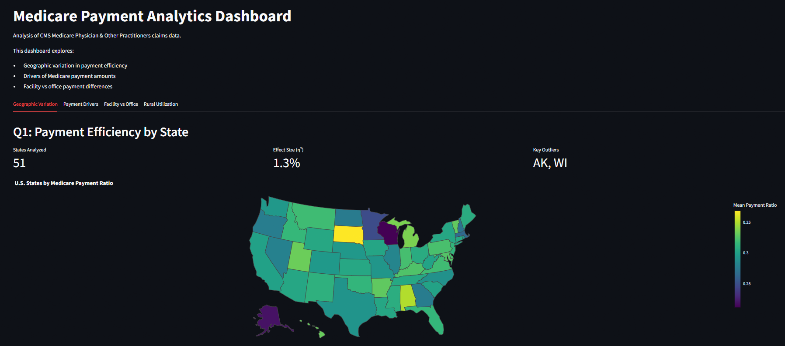

# Healthcare Analytics: Medicare Claims Payment & Utilization Analysis

A statistical analysis of 9.76 million CMS Medicare Physician & Other Practitioners claims records exploring what drives Medicare payments, how reimbursement varies geographically, and where rural-urban utilization gaps appear across healthcare services.

**Live Dashboard:** [Streamlit Dashboard Link Here]



## Overview

This project analyzes CMS Medicare claims data at the provider × HCPCS procedure × place-of-service level to investigate four questions:

1. How much does Medicare payment efficiency vary across states?
2. Which factors most strongly explain Medicare payment amounts?
3. Do facility and office settings receive different payments for identical procedures?
4. Are specific healthcare services utilized less frequently by rural providers compared with urban providers?

The analysis combines exploratory data analysis, statistical hypothesis testing, regression modeling, multiple-comparison correction, effect-size analysis, and interactive visualization.

The main findings include:

- Geographic differences in payment efficiency exist, but state explains only a small proportion of overall variation (**η² ≈ 1.3%**).
- Procedure type is the strongest predictor of Medicare payment amount, increasing model explanatory power from **14.5% to 43.6% adjusted R²** after adding CPT/HCPCS categories.
- Facility vs. office payment differences are concentrated in a small number of procedures, with cataract procedures showing the largest gaps.
- Rural-urban utilization differences are generally small overall (~**-1.8%**), but procedure-level analysis identified **127 HCPCS codes with statistically significant and practically meaningful lower rural service rates**, including concentrations in oncology, radiation, and infusion-related services.

## Motivation
My experience working in healthcare revenue cycle analytics motivated this project by raising questions about where variation enters the path from submitted claims to paid claims. CMS's public data doesn't show when the claim processing actually occurs as a timestamp, so this project uses the closest available proxy in the relationship between what providers bill, what Medicare allows, and what Medicare actually pays to study payment efficiency, not processing time. That distinction is stated here throughout this repo (see `reference/assumptions.md`).

## Data Source
- **Dataset:** CMS Medicare Physician & Other Practitioners by Provider and Service
- **Source:** [data.cms.gov](https://data.cms.gov)
- **Granularity:** Provider x HCPCS procedure code x place of service

## Key Variables
| Variable | What It Enables |
|---|---|
| `Avg_Sbmtd_Chrg` | What providers billed |
| `Avg_Mdcr_Alowd_Amt` | What Medicare allowed |
| `Avg_Mdcr_Pymt_Amt` | What Medicare actually paid |
| `Avg_Mdcr_Stdzd_Amt` | Payment accounting for geographic variation |
| `Tot_Benes` | Patient volume |
| `Tot_Srvcs` | Service volume |
| `Place_Of_Srvc` | Facility v. office setting |
| `HCPCS_Cd` | Procedure code |
| `Rndrng_Prvdr_State_Abrvtn` | State (geographic analysis) |
| `Rndrng_Prvdr_RUCA` | Rural vs. urban classification |
| `Rndrng_Prvdr_Type` | Specialty |

**Derived metric: `payment_ratio`:**
```
payment_ratio = Avg_Mdcr_Pymt_Amt / Avg_Sbmtd_Chrg
```
The fraction of billed charges Medicare actually pays. Used throughout as the closest available metric for claim friction/payment efficiency in this dataset.

## Research Questions

**Q1: Payment efficiency by geography**
Does the typical provider-service payment ratio vary significantly by state? ANOVA and post-hoc tests, visualized with a choropleth map for the US states.

**Q2: Cost drivers**
What predicts `Avg_Mdcr_Pymt_Amt`? Multiple regression using specialty, state, rural/urban classification, place of service, and volume as predictors, with inference like confidence intervals, F-test, residual diagnostics, and so on.

**Q3: Facility vs. non-facility payment differences**
Do providers receive systematically different payments in FACILITY vs. OFFICE settings for the same provider-procedure combination?

A paired analysis is performed by matching the same provider (NPI) and HCPCS procedure across facility and office settings. Wilcoxon signed-rank tests are used because payment differences are paired and not assumed to be normally distributed. Significant procedures are corrected using Benjamini-Hochberg FDR and filtered using a practical effect-size threshold.

**Q4: Utilization patterns by rural/urban status**
Do rural providers serve fewer beneficiaries per service type, and are certain procedures systematically underutilized in rural areas relative to urban ones?

Hypotheses

Q1: Payment efficiency by geography

H_0: `payment_ratio` does not vary significantly by state
H_1: `payment_ratio` varies significantly between at least two states


Q2: Cost drivers

Overall model (F-test): H_0: all regression coefficients = 0 (the model explains no variance in Avg_Mdcr_Pymt_Amt) vs. H₁: at least one coefficient ≠ 0
Per-predictor (t-tests): for each predictor, H_0: \beta = 0 (no effect, holding other predictors fixed) vs. H_1: \beta ≠ 0

Q3: Facility vs. non-facility payment differences

H_0: providers in facility settings do not receive systematically different payments than office settings for the same procedure
H_1: providers in facility settings receive systematically different payments than office settings for the same procedure


Q4a: Beneficiaries served, rural vs. urban

H_0: rural providers serve the same number of beneficiaries per service type as urban providers
H_1: rural providers serve fewer beneficiaries per service type than urban providers
One-sided, right-tailed test on (urban rate - rural rate)


Q4b: Procedure-level underutilization, rural vs. urban
Tested independently for each procedure code, using services-per-beneficiary rate ratios:

H_{0p}: the rural utilization rate for procedure p is not lower than the urban rate
H_{1p}: the rural utilization rate for procedure p is lower than the urban rate

Because this involves one hypothesis test per procedure code so dozens to hundreds of simultaneous tests, raw p-values are corrected for multiple comparisons using the Benjamini-Hochberg (FDR) procedure before any procedure is flagged as significantly underutilized. This controls the expected proportion of false positives among flagged procedures, rather than relying on an uncorrected 0.05 threshold that would produce misleading results at this scale.

## Methodology
Each question is addressed using exploratory data analysis, formal hypothesis testing, statistical modeling, assumption checks, multiple-comparison correction, and effect-size interpretation alongside statistical significance.

## Findings

### Q1: Payment efficiency by geography (DONE)

A one-way ANOVA found a statistically significant difference in mean payment_ratio across states (p < .001), but state explains only a small share of total variation (η² ≈ 1.3%) meaning that most of the spread in `payment_ratio` comes from claim-to-claim variation within states, not from which state a claim was filed in. Post-hoc Tukey HSD testing (filtered to pairs with a practically meaningful gap, |meandiff| > 0.10) showed that the large majority of those meaningful pairwise differences trace back to two extreme states in Alaska (highest) and Wisconsin (lowest) rather than being broadly distributed across all states. Re-running the ANOVA with AK and WI excluded dropped η² from ~1.3% to ~0.9%, confirming these two states account for a disproportionate but not dominant share of the already small state-level effect. Visualized as a state-level choropleth (outputs/figures/).

### Q2: Cost drivers

Multiple regression on a log-transformed version of `Avg_Mdcr_Pymt_Amt` to reduce the impact of extreme right-skewed payment values and improve residual behavior. The log transformation also allows coefficients to be interpreted as multiplicative payment differences. This was built up in stages to isolate what actually explains payment amount. A baseline model with state, top 40 specialties, place of service, rural/urban status, and patient volume explained only 14.5% of variance by adjusted R². Adding a procedure-type predictor in the CPT/HCPCS codes grouped into the categories Anesthesia, Surgery, Radiology, Pathology/Lab, Medicine, E/M, Drugs, etc., derived from official CPT numeric ranges and HCPCS Level II letter prefixes then raised adjusted R² to 43.6%, demonstrating that procedure type was the strongest predictor of payment amount among evaluated variables. All predictors were statistically significant at p < .001 given the sample size of ~9.76M rows.

Holding procedure type, specialty, state, place of service, and volume constant, rural providers are associated with roughly a 5.4% lower average payment than urban providers which is interesting because the gap was around 10% before procedure mix was controlled for. That shows me part of the raw rural/urban payment gap reflects a difference in what procedures are performed rather than the rural/urban payment for the same procedure.

In addition, here are some diagnostics of note:
(1) a handful of procedure categories that were almost empty like DME, Orthotics/Prosthetics initially destabilized coefficient estimates and inflated the model's condition number roughly 20x. However, collapsing them into an "Other" bucket resolved this with no important loss in adjusted R². 

(2) the model's remaining moderate condition number turned out to be a pure scale artifact from `Tot_Benes` or patient volume, ranging into the thousands sitting alongside 0/1 dummy variables, not genuine multicollinearity between predictors. Then, standardizing Tot_Benes using z-scores dropped the condition number from ~1.95e+05 to 198 with no change to any other coefficient, R², or significance level, confirming the model was numerically stable all along.

### Q3: Facility vs. non-facility payment differences (DONE)

A paired provider-procedure analysis was conducted to compare facility and office Medicare payments for the same HCPCS procedure performed by the same rendering provider. After filtering to procedures with sufficient paired observations, Wilcoxon signed-rank tests were performed and corrected using Benjamini-Hochberg false discovery rate adjustment.

Statistical significance alone identified several procedures with small payment differences, so median log-payment differences were converted back into percentage differences using exp(median_diff)-1. A practical significance threshold of 5% was selected based on the observed distribution of significant effects.

Seven procedures exceeded the practical significance threshold. The largest differences were observed for cataract procedures:
- HCPCS 66984: approximately 10.5x higher facility payment (+950%)
- HCPCS 66982: approximately 4.8x higher facility payment (+376%)

Other significant procedures showed smaller but still meaningful differences ranging from approximately 5-17%. The procedures spanned multiple specialties including ophthalmology, anesthesia, cardiology, and anticoagulation management rather than clustering into a single specialty.

### Q4: Rural vs. urban utilization differences (DONE)

#### Q4a: Overall rural-urban utilization gap

An aggregate comparison of service utilization rates found a statistically significant but relatively small difference between rural and urban providers. Rural providers served approximately **1.8% fewer beneficiaries per service type** than urban providers overall.

This suggests that rural-urban utilization differences are not large when averaged across all healthcare services. However, an aggregate metric can hide substantial variation in specific procedures, which motivated a procedure-level analysis.

#### Q4b: Procedure-level rural underutilization patterns

To identify whether specific healthcare services showed larger rural-urban gaps, each HCPCS procedure code was tested independently using services-per-beneficiary utilization rates. Because 1,497 procedures were tested simultaneously, p-values were corrected using the **Benjamini-Hochberg false discovery rate (FDR)** procedure to control false positives.

Among the tested procedures:
- **289 HCPCS codes** showed statistically significant rural-urban differences after FDR correction.
- **127 HCPCS codes** remained after applying a practical significance threshold requiring rural utilization to be at least **5% lower** than urban utilization.

The largest differences were concentrated in specialized services, particularly:
- oncology-related procedures,
- radiation therapy,
- chemotherapy administration,
- infusion services,
- injectable specialty medications.

Approximately **37% of practically significant procedures** were identified as oncology/infusion-related based on HCPCS description classification. However, meaningful gaps were also observed across laboratory, imaging, and other procedure categories.

These findings suggest that rural-urban utilization differences are not a uniform reduction across all healthcare services, but instead are concentrated in specific areas of specialized care where access, availability of specialists, and treatment infrastructure may play a larger role.

## Limitations
This dataset reflects paid claims outcomes, not claims processing timelines. It cannot measure time-to-payment, denial-to-resubmission cycles, or true revenue cycle bottlenecks because understand those require proprietary claims processing timestamp data. `payment_ratio` and related metrics are proxies for payment efficiency and billing consistency, not direct measures of processing friction. This limitation is documented, again, in `reference/assumptions.md`

## Project Structure
```
healthcare-analytics/
├── data/
│   └── raw/              # downloaded CMS files
├── notebooks/
│   ├── 01_eda.ipynb      # exploratory analysis
│   ├── 02_cleaning.ipynb # data cleaning decisions
│   └── 03_modeling.ipynb # regression + inference
├── src/
│   ├── data_loader.py    # loading and preprocessing
│   └── model.py          # model fitting utilities
├── app/
│   └── dashboard.py      # Streamlit results dashboard
├── outputs/
│   ├── figures/          # saved charts
│   └── model_results/    # coefficient tables, diagnostics
├── reference/
│   └── assumptions.md    # explicit statement of data limitations
├── requirements.txt
└── README.md
```

## Tech Stack
Python, pandas, statsmodels, Plotly (choropleth mapping), Streamlit

## Status
Completed:
- Q1: Geographic payment ratio variation
- Q2: Medicare payment cost driver regression
- Q3: Facility vs. non-facility procedure payment analysis
- Q4: Rural/urban utilization analysis
- Streamlit dashboard development

Remaining:
- Public deployment
- Final documentation cleanup
